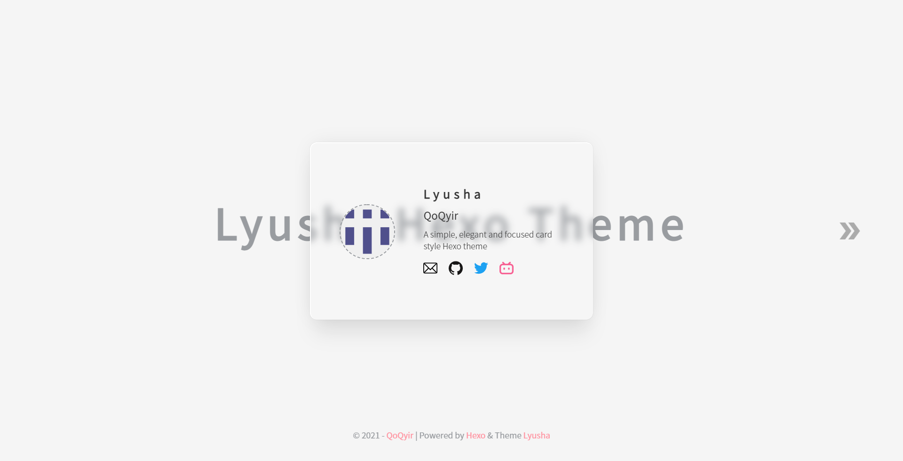

# hexo-theme-lyusha

<a href="https://sample.qoqyir.com/hexo-theme-lyusha/" target="_blank">Demo</a>



<br>

[more pictures](./screenshot/)

<br>

>A simple, elegant and focused card style Hexo theme.

## Table of Contents

  - [Installation](#installation)
  - [Configuration](#configuration)
  - [Somethings](#somethings)
  - [Maintainers](#maintainers)
  - [License](#license)

## Installation

```
# install theme files
npm install hexo-theme-lyusha --save

# install plugin, this theme uses markdown-it as the markdown renderer.
npm uninstall hexo-renderer-marked --save
npm install hexo-autoprefixer --save
npm install hexo-renderer-markdown-it --save
npm install markdown-it-checkbox --save
npm install markdown-it-pangu --save
```

## Configuration

<details>
<summary>
Theme config (Click here for details)
</summary>

```
# create a "_config.lyusha.yml" file in the root directory
# and add the following content to this file

# base
avatar: https://api.prodless.com/avatar.png
index_text: 'Lyusha Hexo Theme'
description: 'A simple, elegant and focused card style Hexo theme'
language: zh-CN
footer_author_link: https://github.com/Qyir/

# links
# https://simpleicons.org/
links:
  - name: email
    url: voyoaugi@gmail.com
  - name: github
    url: https://github.com/Qyir/
  - name: twitter
    url: https://twitter.com/QoQyir
  - name: bilibili
    url: https://space.bilibili.com/89553968
  # - name: instagram
  #   url:
  # - name: telegram
  #   url:
  # - name: zhihu
  #   url:
  # - name: sinaweibo
  #   url:
  ## other social links
  # - name:
  #   url:
  #   icon:

# about the "latest" mark
post_latest: true

# path of posts collection folder and posts list page
articles_folder: ''
```
</details>

<details>
<summary>
Hexo config (Click here for details)
</summary>

```
...
# add to hexo '_config.yml'

# Hexo-autoprefixer
autoprefixer:
  exclude:
    - '*.min.css'
  browsers:
    - 'last 2 versions'

# hexo-renderer-markdown-it
markdown:
  preset: 'default'
  render:
    html: true
    xhtmlOut: false
    langPrefix: 'language-'
    breaks: true
    linkify: true
    typographer: true
    quotes: '“”‘’'
  enable_rules:
  disable_rules:
  plugins:
    - markdown-it-abbr
    - markdown-it-cjk-breaks
    - markdown-it-container
    - markdown-it-deflist
    - markdown-it-emoji
    - markdown-it-footnote
    - markdown-it-ins
    - markdown-it-mark
    - markdown-it-sub
    - markdown-it-sup
    - markdown-it-pangu
    - name: 'markdown-it-checkbox'
      options:
        divWrap: true
        readonly: true # set the input to be readonly. this ensures that users cannot toggle the checkbox in the browser
  anchors:
    level: 1
    collisionSuffix: ''
    permalink: true
    permalinkClass: 'header-anchor'
    permalinkSide: 'left'
    permalinkSymbol: ''
    case: 1
    separator: '-'
```
</details>

## Somethings

This project is currently suspended, because some things make me busy. But don't worry, as long as I have time, I will continue to develop and update.

## Maintainers

[@QoQiyu]([https://github.com/Qyir](https://github.com/qoqiyu)

## License

[MIT](./LICENSE) © Qodallr Liu

